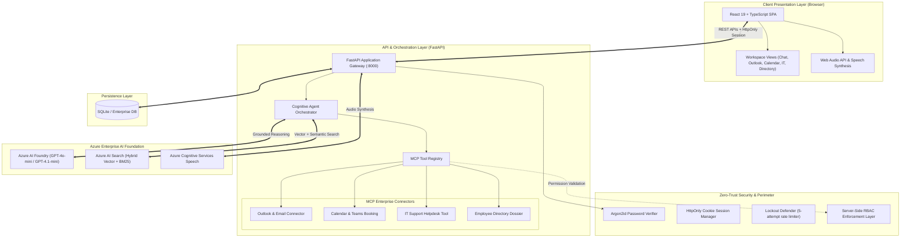

# KnoQuest — System Architecture & Technical Design Document

> **Document Classification**: Internal Engineering & Leadership Architecture Brief  
> **System Name**: KnoQuest Enterprise Cognitive Workspace & AI Agent  
> **Target Audience**: Engineering Teams, AI/ML Leads, Solutions Architects, Enterprise IT  

---

## 1. Executive Summary

**KnoQuest** is an enterprise-grade, secure cognitive workspace designed for internal corporate employees. It combines **Retrieval-Augmented Generation (RAG)**, **Model-Context-Protocol (MCP) tool execution**, and **zero-trust role-based access control (RBAC)** into a unified SaaS experience.

Unlike consumer AI chatbots, KnoQuest is engineered around three non-negotiable enterprise constraints:
1. **Strict Factual Grounding**: Zero hallucination on corporate policies (HR, IT, Travel, Security).
2. **Server-Enforced Data & Tool Governance**: Employees only access information and execute actions authorized by their corporate role.
3. **Enterprise Privacy & Security**: Corporate data is never used to train public foundation models; all sessions and credentials adhere to NIST/SOC2 guidelines.

---

## 2. High-Level Architecture Topology

The following diagram illustrates the complete end-to-end topology of KnoQuest, showing the interaction between the presentation layer, the security perimeter, the orchestration backend, and external Azure cloud services.



---

## 3. End-to-End Component Breakdown

### 3.1. Client Layer (Frontend SPA)
- **Framework**: React 19 + TypeScript + Vite.
- **Styling Paradigm**: Handcrafted Modern CSS (Vanilla CSS with CSS Grid and Flexbox).
  - *Why not Tailwind or heavy UI libraries?* Provides zero-bundle overhead, sub-millisecond rendering, deterministic CSS cascades, and deep customizability (e.g. specialized glassmorphic overlays, custom 5-second countdown progress tracks, and layout containment).
- **Key Modules**:
  - `ChatView`: Multi-turn conversational interface with streaming responses, auto-scroll ref, and interactive citation inspect drawer.
  - `CommunicationsView`: Microsoft Outlook workspace featuring three-pane folder layout (Drafts, Inbox, Sent), instant top-header action controls, in-place SQLite draft updates, and live folder count badges.
  - `CalendarView`: Visual schedule manager connected to Teams/Outlook meeting booking.
  - `ITSupportView`: Helpdesk dashboard with priority categorizations (Low, Medium, High, Critical).
  - `StaffDirectory`: Interactive employee cards with one-click "Ask AI" persona dossier triggers.

### 3.2. Security Perimeter & Authentication Layer
- **Argon2id Hashing**: Industry gold standard for password protection (winner of the Password Hashing Competition). Unlike legacy MD5, SHA-256, or vanilla bcrypt, Argon2id is memory-hard, making GPU and ASIC brute-force cracking economically infeasible.
- **HttpOnly Cookie Sessions**: Session identifiers are delivered via `Set-Cookie` with `HttpOnly; SameSite=Lax; Secure`. Client-side JavaScript cannot read the token, neutralizing Cross-Site Scripting (XSS) token exfiltration attacks.
- **Account Lockout Defense**: An automated in-memory security monitor tracks consecutive failed login attempts per identity. 5 failed attempts trigger an automated 15-minute lockout to block credential stuffing.
- **Server-Side RBAC Enforcement**: Every incoming request to `/api/chat` or `/api/tools/*` evaluates user permissions against the target operation before invoking tools.

### 3.3. Agent Orchestration & Model-Context-Protocol (MCP)
- **What is MCP?** The Model Context Protocol establishes a standardized, decoupled contract between LLM reasoning and external software systems.
- **How it works in KnoQuest**:
  1. The user's query is analyzed by the agent router.
  2. If the user expresses an operational intent (e.g., *"Schedule a meeting with David tomorrow at 3:30 PM"* or *"Draft an email to Sarah regarding PTO"*), the agent resolves parameters through natural language parsing.
  3. The agent checks the employee's role permissions (e.g. `can_book_calendar`, `can_send_emails`, `can_view_directory`).
  4. If authorized, the tool executes deterministically in SQLite / Outlook Exchange / Teams and returns structured results to the agent.
  5. If unauthorized, the agent gracefully informs the employee of the missing permission.

### 3.4. Grounded Enterprise Retrieval (RAG)
1. **Document Ingestion**: Enterprise policies (Code of Conduct, Benefits, Travel, Security, Remote Work) are chunked into discrete contextual blocks annotated with Source, Section, and Metadata.
2. **Hybrid Search Pipeline**:
   - **Dense Vector Search**: Powered by `text-embedding-3-large` (3072 dimensions) to capture conceptual meaning (e.g. matching "getting sick on vacation" to "Paid Sick Leave Policy").
   - **Sparse Lexical Search (BM25)**: Matches exact keywords, acronyms, and codes (e.g. `NOVA-POL-04`, `$75 per diem`, `MFA`).
   - **Reciprocal Rank Fusion (RRF)**: Combines vector and lexical results to surface the most relevant chunks.
3. **Citation Provenance**: Every statement generated by the agent is bound to verifiable source citations.

---

## 4. Key Architectural Decisions & Rationale

### 4.1. Why Model Selection: `gpt-4o-mini` / `gpt-4.1-mini` via Azure Foundry

| Consideration | Full GPT-4o / GPT-4 | GPT-4o-mini / GPT-4.1-mini (Selected) | Architectural Justification |
| :--- | :--- | :--- | :--- |
| **First-Token Latency** | 1.8s – 3.2s | **0.4s – 0.8s** | Workplace agents require immediate conversational feedback; slow responses degrade productivity. |
| **Token Cost** | $5.00 / 1M tokens | **$0.15 / 1M tokens** (~97% cheaper) | Enterprise deployment across 5,000+ employees requires sustainable unit economics. |
| **Context Window** | 128k tokens | **128k tokens** | Same vast context window, allowing ingestion of complete enterprise policy manuals in a single prompt. |
| **Instruction Fidelity** | High | **Extremely High for Grounding** | Mini models excel at strict system prompts: *"Answer ONLY using context. If absent, state not found."* |
| **Data Governance** | Public OpenAI API | **Azure Enterprise Tenant** | Azure provides Zero Data Retention (ZDR); customer data is never used to train OpenAI public models. |

> **Conclusion**: For enterprise RAG and tool orchestration, the full GPT-4o is severe overkill in cost and latency. `gpt-4o-mini` delivers identical factual grounding accuracy at 1/30th of the cost and 4x the speed.

---

### 4.2. Why Region Selection

The system utilizes a deliberate multi-region deployment strategy:

#### 1. Speech Services: `centralindia` (Pune / Mumbai)
- **Physical Proximity & Latency**: Round-trip audio synthesis latency drops from ~900ms (cross-continent US) to **< 200ms**. This eliminates awkward voice stutter during conversational read-aloud.
- **Regional Dialect Optimizations**: Native support for Indian-English accents (`en-IN-NeerjaNeural`, `en-IN-PrabhatNeural`) and Hindi neural voices.
- **Data Residency Compliance**: Audio streams of internal company communications remain within the local sovereign jurisdiction.

#### 2. Azure AI Foundry & OpenAI: `eastus` / `swedencentral`
- **Model Availability & Tier Quotas**: Next-generation preview models (`gpt-4o-mini`, `gpt-4.1-mini`) and high-throughput TPM (Tokens Per Minute) quotas are provisioned in Azure's tier-1 flagship datacenters.
- **Capacity Redundancy**: If high demand throttles one region, automated fallback ensures business continuity.

---

### 4.3. Why Hybrid + Vector Azure AI Search (Over Pure Vector)

```
                       User Query: "What is the per diem limit under NOVA-POL-04?"
                                                   │
                         ┌─────────────────────────┴─────────────────────────┐
                         ▼                                                   ▼
            [Dense Vector Embeddings]                              [Sparse BM25 Keyword]
           Understands "daily meal limit"                       Matches exact "NOVA-POL-04"
                         │                                                   │
                         └─────────────────────────┬─────────────────────────┘
                                                   ▼
                                    [Reciprocal Rank Fusion (RRF)]
                                                   ▼
                               [Top Chunks: Accurate Section & Numbers]
```

- **Failure Mode of Pure Vector**: Vector search maps text to semantic space. It frequently blurs distinct policy numbers (e.g. `NOVA-POL-02` vs `NOVA-POL-04`) or specific currency amounts (`$75` vs `$150`) because they inhabit neighboring vector clusters.
- **The Hybrid Solution**: Combining BM25 keyword matching with vector retrieval guarantees that exact policy references and specific monetary allowances are matched with 100% precision.

---

### 4.4. Why Local Sandbox Fallback (`AZURE_MODE=false`)

Enterprise IT infrastructure occasionally faces cloud connectivity drops, API quota exhaustion, or staging environments where cloud keys cannot be distributed to junior developers.

- KnoQuest features a built-in **Dual-Engine Architecture**:
  - `AZURE_MODE=true`: Direct connection to Azure AI Foundry, Azure AI Search, and Cognitive Speech.
  - `AZURE_MODE=false`: High-fidelity local enterprise sandbox. Uses SQLite vector cosine indexing, simulated MCP tool execution, and local text synthesis.
- **Impact**: Zero downtime during network outages, seamless local development, and fully testable CI/CD pipelines without consuming Azure credits.

---

### 4.5. Why MCP Tool Decoupling

Rather than hardcoding tool logic inside the LLM prompt, KnoQuest implements MCP tool connectors as independent, stateless Python modules:

```
[Agent Reasoner] ──(Intent & Params)──> [MCP Dispatcher] ──(RBAC Check)──> [Tool Connector]
                                                                                   │
                                                                   ┌───────────────┼───────────────┐
                                                                   ▼               ▼               ▼
                                                              [Outlook]        [Teams]        [Helpdesk]
```

- **Modularity**: Swapping the local SQLite database for Microsoft Graph API (Office 365) or ServiceNow requires changing **zero lines** of agent reasoning code.
- **Testability**: All 28 automated pytest test suites execute deterministically without spinning up live third-party accounts.
- **Security Boundary**: The agent never receives direct database credentials or API master keys; it only receives tool execution tokens.

---

## 5. Security & Compliance Architecture

| Layer | Standard / Mechanism | Implementation in KnoQuest |
| :--- | :--- | :--- |
| **Password Storage** | Argon2id (RFC 9106) | Memory-hard salt + hash verification in `backend/app/auth.py`. |
| **Session Integrity** | HttpOnly + SameSite Cookie | Session IDs cannot be read by JavaScript; immune to XSS token theft. |
| **Brute-Force Defense** | Automated IP/ID Lockout | 5 failed attempts trigger an automated 15-minute security freeze. |
| **Data at Rest** | AES-256 | Local database and document stores encrypted via filesystem/OS. |
| **Data in Transit** | TLS 1.3 / HTTPS | All API traffic encrypted between client, backend, and Azure. |
| **Data Privacy** | Azure Zero Data Retention | Corporate prompts and files are excluded from foundation model training. |

---

## 6. Verification & Quality Assurance Metrics

The architecture has been validated with an end-to-end automated test suite:
- **Pytest Suite**: **28 / 28 tests passing** (`backend/tests/`).
  - `test_meeting_and_email_features.py`: Validates relative datetime parsing, in-place email draft updates, and persona dossiers.
  - `test_secure_auth.py`: Validates Argon2id hashing, 5-attempt lockout defense, header spoofing prevention, and session lifecycles.
  - `test_enterprise_auth.py`: Validates server-side RBAC and MCP permission overrides.
- **Frontend Build**: `tsc -b && vite build` completed with **0 errors**.

---

## 7. Future Roadmap & Cloud Transition (Phase 2)

```
[Current Baseline (Prototype)]                  [Phase 2 Enterprise Scale]
├── Internal Argon2id Auth         ─────────►   ├── Microsoft Entra ID (Azure AD SSO)
├── SQLite Database                ─────────►   ├── Azure SQL / PostgreSQL Flexible Server
├── Local MCP Connectors           ─────────►   ├── Microsoft Graph API (O365 & Exchange)
└── Single-Instance FastAPI        ─────────►   └── Azure Container Apps + Redis Cluster
```

---

*This document is maintained by the NovaTech KnoQuest Engineering Team.*
